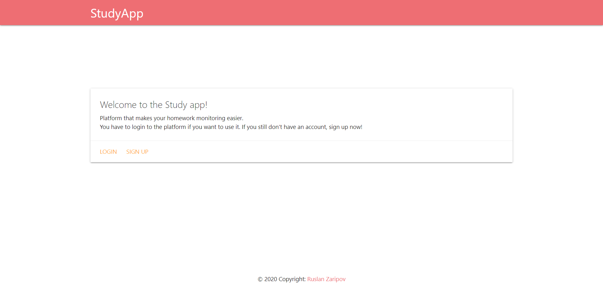
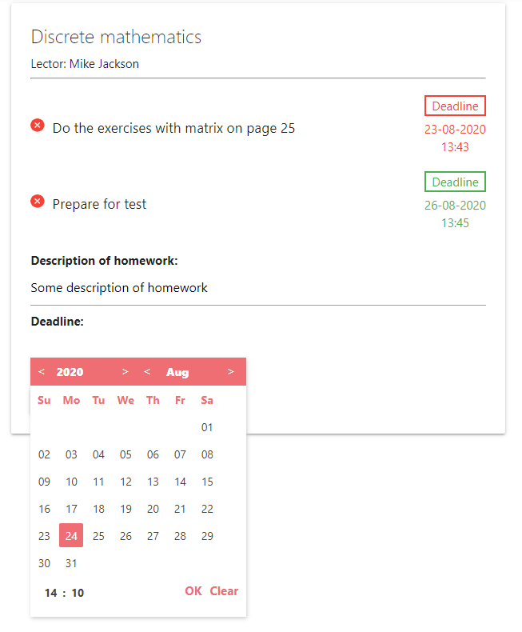

# StudyApp (backend api + frontend with Vue.js)
## Project based on REST API (Django rest framework), frontend part with Vue.js and [android app](https://github.com/G33kFreak/StudyAppMobile). Authentication system uses JWT tokens.  

# Start page

# Login page
Username is a first letter of name and last name without space between them.

# Main page
### Main page is diffrent for students and lectors (staff permissions)
#### How does it look like for lectors

#### How doest it look like for students 

# Creating homework system
After tapping on "Add homework" button opening form with description input field and timePicker for deadline.
Also lector can remove some homework (red point with a cross).

# Profile page
Simple profile page with status of user (student or lector) and main informations.

